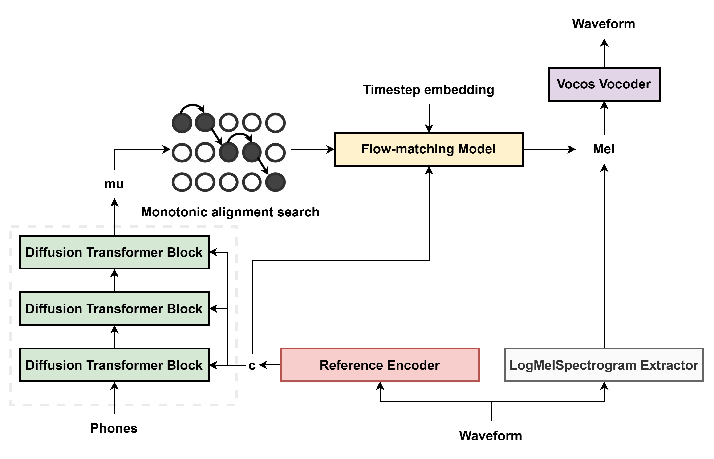

<div align="center">

# StableTTS — Inpainting Fork

**Fork of [KdaiP/StableTTS](https://github.com/KdaiP/StableTTS) with audio inpainting / speech editing additions.**

This fork: [JEdward7777/StableTTS_Editing](https://github.com/JEdward7777/StableTTS_Editing)

</div>

---

## About this fork

This repository extends StableTTS with the ability to **inpaint** (surgically re-generate) specific words or phrases inside an existing audio recording while leaving the surrounding audio untouched.  The additions were developed by **Joshua Lansford** during the 2025 and 2026 OCE/OBT Hackathons, with additional work supported by **Mission Mutual**.

The upstream StableTTS model and training code are unchanged.  All inpainting capability is layered on top through new modules and modified inference paths described below.

---

## What was added

### Core inpainting mechanism — `models/flow_matching.py`

The [`CFMDecoder.forward()`](models/flow_matching.py:27) method was extended to support **RePaint-style inpainting** ([Lugmayr et al., 2022](https://arxiv.org/abs/2201.09865)) adapted from DDPM to Conditional Flow Matching.

When `prefix` and/or `postfix` mel spectrograms are supplied:

- The full sequence (prefix + edit region + postfix) is initialised as noise.
- At every ODE step the model sees the **full context** (not just the edit region), so the generated audio is conditioned on the surrounding speech.
- After each step the known regions are **re-injected** at the correct noise level for that timestep: `x_t = (1−t)·noise + t·clean_mel`.
- Optionally, **resampling jumps** (`repaint_jumps`, `jump_length`, `jump_n_sample`) can be enabled to traverse each segment multiple times for better boundary coherence.
- A `save_trajectory` debug flag saves mel-spectrogram snapshots to `./trajectory_debug/` at each step.

The two internal paths are [`_forward_standard()`](models/flow_matching.py:76) (unchanged ODE solve, no inpainting) and [`_forward_repaint()`](models/flow_matching.py:89) (new, selected automatically when prefix/postfix are present).

### Model synthesis — `models/model.py`

[`StableTTS.synthesise()`](models/model.py:49) was extended to accept `prefix`, `postfix`, `prefix_text`, and `suffix_text` arguments.  When prefix/suffix text is provided, it is concatenated with the edit text before encoding so the text encoder sees the full surrounding context.  The resulting `mu_y` is then split back into prefix, edit, and suffix segments and passed to the decoder.

### Inference API — `api.py`

[`StableTTSAPI.inference()`](api.py:67) was extended to accept `prefix`, `postfix`, `prefix_text`, `suffix_text`, and `blend_opts`.  Each of these may be a file path (loaded and converted to mel on the fly) or a pre-computed `torch.Tensor` (used directly, avoiding redundant I/O).

### MAS-based text-to-audio alignment — `alignment.py`

New module [`alignment.py`](alignment.py) exposes two key functions:

- [`align_text_to_audio()`](alignment.py:21) — runs the model's own Monotonic Alignment Search (MAS) at inference time on an arbitrary (text, audio) pair to produce per-token mel-frame durations.  Accepts a pre-computed mel tensor to avoid file I/O on subsequent iterations.
- [`text_position_to_mel_frame()`](alignment.py:263) — converts a character position in the transcript to the corresponding mel frame index using piecewise G2P + MAS durations.

### JLDiff-based multi-edit detection — `multi_edit_diff.py`

New module [`multi_edit_diff.py`](multi_edit_diff.py) wraps [JLDiff](https://github.com/JEdward7777/JLDiff) to compute word-level diffs between two text strings and extract discrete [`EditRegion`](multi_edit_diff.py:33) objects (insertion / deletion / substitution) with character positions in both the original and edited text.  Edits are returned in **right-to-left order** so that applying them iteratively does not shift earlier character positions.

### Interactive multi-edit Gradio app — `multi_edit_app.py`

[`multi_edit_app.py`](multi_edit_app.py) is a Gradio web UI that:

1. Accepts reference audio + original transcript + edited transcript.
2. Detects all edit regions with JLDiff.
3. Applies each edit **right-to-left**, re-running MAS alignment after each step so the next edit's frame boundaries are always accurate.
4. Displays intermediate audio after each edit step.
5. Exposes RePaint resampling-jump controls and a trajectory debug toggle.

Optional Whisper integration (via `whisper_timestamped`) provides a one-click transcription button.

### Batch inpainting pipeline — `batch_inpaint.py`

[`batch_inpaint.py`](batch_inpaint.py) is a command-line tool for processing large collections of audio files.  It reads a **source CSV** (`verse_id`, `transcription`, `file_name`) and a **target CSV** (`verse_id`, `transcription`), inpaints every verse where the transcription differs, and writes an **output CSV** alongside the generated audio files.

Key features:
- Skips verses where the texts are identical (transcodes source audio unchanged).
- Skips edits that only change punctuation/whitespace (no audible content to splice).
- Supports `--force` and `--target_verse` for selective re-generation.
- Supports multiple output formats (`wav`, `mp3`, `flac`, `ogg`).
- Exposes all RePaint parameters as CLI flags.

#### CSV schemas

| CSV | Required columns | Notes |
|-----|-----------------|-------|
| `from_csv` | `verse_id`, `transcription`, `file_name` | `file_name` is the path to the source audio, relative to the CSV file's directory |
| `to_csv` | `verse_id`, `transcription` | Target transcriptions; rows are matched to `from_csv` by `verse_id` |
| `out_csv` | `verse_id`, `transcription`, `file_name` | Written by the script; audio files are saved in an `audio/` sub-folder next to the CSV |

#### `verse_id` format

`batch_inpaint.py` treats `verse_id` as an **opaque unique string**.  Any value is acceptable as long as it is unique within each CSV and consistent between `from_csv` and `to_csv` so that rows can be matched.  The value is also used (after sanitising non-word characters to `_`) as the stem of the output audio filename.

The intended use case is scripture audio, where `verse_id` follows the **USFM 3-letter book-code** convention:

```
BOOK CHAPTER:VERSE          e.g.  MAT 1:1
BOOK CHAPTER:VERSE_START-VERSE_END   e.g.  1CO 3:10-11
```

This format is **required by `demo_inpainting.py`**, which parses it to power its book/chapter navigation UI and to sort verses in canonical 66-book Protestant Bible order.

#### Note on scripture coupling

The column name `verse_id` and the USFM reference format are the primary scripture-specific aspects of this pipeline.  `batch_inpaint.py` itself is fully generic — it does not parse the `verse_id` value in any way.  To adapt the batch pipeline for non-scripture audio (e.g. audiobook chapters, podcast segments):

- `verse_id` can contain any unique identifier (e.g. `"chapter_03_segment_07"`).
- `batch_inpaint.py` will work without modification.
- `demo_inpainting.py` assumes USFM-parseable IDs for its navigation; using it with non-scripture IDs would require rewriting the [`parse_verse_id()`](demo_inpainting.py:28) function and the [`CANON_ORDER`](demo_inpainting.py:61) sort logic.

### Comparison demo — `demo_inpainting.py`

[`demo_inpainting.py`](demo_inpainting.py) is a read-only Gradio viewer for comparing source and inpainted audio side-by-side, navigating by book/chapter/verse.  It is designed to be used after `batch_inpaint.py` has produced an output CSV.

---

## Quick-start: inpainting

### Interactive (single edit)

```bash
python3 multi_edit_app.py --tts_model ./checkpoints/checkpoint_0.pt
```

Open the Gradio URL, upload reference audio, provide the original and edited transcripts, and click **Generate All Edits**.

### Batch (CSV-driven)

```bash
python3 batch_inpaint.py \
    --from_csv  path/to/source.csv \
    --to_csv    path/to/target.csv \
    --out_csv   path/to/output.csv \
    --tts_model ./checkpoints/checkpoint_0.pt \
    --language  english \
    --step 25 \
    --cfg 3.0
```

### View results

```bash
python3 demo_inpainting.py \
    --from_csv path/to/source.csv \
    --to_csv   path/to/output.csv
```

---

## Inpainting parameters

| Parameter | Default | Description |
|-----------|---------|-------------|
| `--step` | 25 | ODE integration steps per edit |
| `--temperature` | 1.0 | Noise temperature |
| `--length_scale` | 1.0 | Speech pace (>1 = slower) |
| `--solver` | `dopri5` | ODE solver for non-inpainting regions |
| `--cfg` | 3.0 | Classifier-free guidance scale |
| `--min_match` | 2 | JLDiff coalescence threshold (chars) |
| `--repaint_jumps` | off | Enable RePaint resampling jumps |
| `--jump_length` | 3 | Forward steps before each jump |
| `--jump_n_sample` | 3 | Traversals per segment (incl. first) |

---

---

<!-- ============================================================ -->
<!-- Original StableTTS README follows, preserved in full below.  -->
<!-- ============================================================ -->

<div align="center">

# StableTTS

Next-generation TTS model using flow-matching and DiT, inspired by [Stable Diffusion 3](https://stability.ai/news/stable-diffusion-3).


</div>

## Introduction

As the first open-source TTS model that tried to combine flow-matching and DiT, **StableTTS** is a fast and lightweight TTS model for chinese, english and japanese speech generation. It has 31M parameters.

✨ **Huggingface demo:** [🤗](https://huggingface.co/spaces/KdaiP/StableTTS1.1)

## News

2024/10: A new autoregressive TTS model is coming soon...

2024/9: 🚀 **StableTTS V1.1 Released** ⭐ Audio quality is largely improved ⭐

⭐ **V1.1 Release Highlights:**

- Fixed critical issues that cause the audio quality being much lower than expected. (Mainly in Mel spectrogram and Attention mask)
- Introduced U-Net-like long skip connections to the DiT in the Flow-matching Decoder.
- Use cosine timestep scheduler from [Cosyvoice](https://github.com/FunAudioLLM/CosyVoice)
- Add support for CFG (Classifier-Free Guidance).
- Add support for [FireflyGAN vocoder](https://github.com/fishaudio/vocoder/releases/tag/1.0.0).
- Switched to [torchdiffeq](https://github.com/rtqichen/torchdiffeq) for ODE solvers.
- Improved Chinese text frontend (partially based on [gpt-sovits2](https://github.com/RVC-Boss/GPT-SoVITS)).
- Multilingual support (Chinese, English, Japanese) in a single checkpoint.
- Increased parameters: 10M -> 31M.


## Pretrained models

### Text-To-Mel model

Download and place the model in the `./checkpoints` directory, it is ready for inference, finetuning and webui.

| Model Name | Task Details | Dataset | Download Link |
|:----------:|:------------:|:-------------:|:-------------:|
| StableTTS | text to mel | 600 hours | [🤗](https://huggingface.co/KdaiP/StableTTS1.1/resolve/main/StableTTS/checkpoint_0.pt)|

### Mel-To-Wav model

Choose a vocoder (`vocos` or `firefly-gan` ) and place it in the `./vocoders/pretrained` directory.

| Model Name | Task Details | Dataset | Download Link |
|:----------:|:------------:|:-------------:|:-------------:|
| Vocos | mel to wav | 2k hours | [🤗](https://huggingface.co/KdaiP/StableTTS1.1/resolve/main/vocoders/vocos.pt)|
| firefly-gan-base | mel to wav | HiFi-16kh | [download from fishaudio](https://github.com/fishaudio/vocoder/releases/download/1.0.0/firefly-gan-base-generator.ckpt)|

## Installation

1. **Install pytorch**: Follow the [official PyTorch guide](https://pytorch.org/get-started/locally/) to install pytorch and torchaudio. We recommend the latest version (tested with PyTorch 2.4 and Python 3.12).

2. **Install Dependencies**: Run the following command to install the required Python packages:

```bash
pip install -r requirements.txt
```

## Inference

For detailed inference instructions, please refer to `inference.ipynb`

We also provide a webui based on gradio, please refer to `webui.py`

## Training

StableTTS is designed to be trained easily. We only need text and audio pairs, without any speaker id or extra feature extraction. Here's how to get started:

### Preparing Your Data

1. **Generate Text and Audio pairs**: Generate the text and audio pair filelist as `./filelists/example.txt`. Some recipes of open-source datasets could be found in `./recipes`.

2. **Run Preprocessing**: Adjust the `DataConfig` in `preprocess.py` to set your input and output paths, then run the script. This will process the audio and text according to your list, outputting a JSON file with paths to mel features and phonemes.

**Note: Process multilingual data separately by changing the `language` setting in `DataConfig`**

### Start training

1. **Adjust Training Configuration**:  In `config.py`, modify `TrainConfig` to set your file list path and adjust training parameters (such as batch_size) as needed.

2. **Start the Training Process**: Launch `train.py` to start training your model.

Note: For finetuning, download the pretrained model and place it in the `model_save_path` directory specified in  `TrainConfig`. Training script will automatically detect and load the pretrained checkpoint.

### (Optional) Vocoder training

The `./vocoder/vocos` folder contains the training and finetuning codes for vocos vocoder.

For other types of vocoders, we recommend to train by using [fishaudio vocoder](https://github.com/fishaudio/vocoder): an uniform interface for developing various vocoders. We use the same spectrogram transform so the vocoders trained is compatible with StableTTS.

## Model structure

<div align="center">

<p style="text-align: center;">
  
</p>

</div>

- We use the Diffusion Convolution Transformer block from [Hierspeech++](https://github.com/sh-lee-prml/HierSpeechpp), which is a combination of original [DiT](https://github.com/sh-lee-prml/HierSpeechpp) and [FFT](https://arxiv.org/pdf/1905.09263.pdf)(Feed forward Transformer from fastspeech) for better prosody.

- In flow-matching decoder, we add a [FiLM layer](https://arxiv.org/abs/1709.07871) before DiT block to condition timestep embedding into model.

## References

The development of our models heavily relies on insights and code from various projects. We express our heartfelt thanks to the creators of the following:

### Direct Inspirations

[Matcha TTS](https://github.com/shivammehta25/Matcha-TTS): Essential flow-matching code.

[Grad TTS](https://github.com/huawei-noah/Speech-Backbones/tree/main/Grad-TTS): Diffusion model structure.

[Stable Diffusion 3](https://stability.ai/news/stable-diffusion-3): Idea of combining flow-matching and DiT.

[Vits](https://github.com/jaywalnut310/vits): Code style and MAS insights, DistributedBucketSampler.

### Additional References:

[plowtts-pytorch](https://github.com/p0p4k/pflowtts_pytorch): codes of MAS in training

[Bert-VITS2](https://github.com/Plachtaa/VITS-fast-fine-tuning) : numba version of MAS and modern pytorch codes of Vits

[fish-speech](https://github.com/fishaudio/fish-speech): dataclass usage and mel-spectrogram transforms using torchaudio, gradio webui

[gpt-sovits](https://github.com/RVC-Boss/GPT-SoVITS): melstyle encoder for voice clone

[coqui xtts](https://huggingface.co/spaces/coqui/xtts): gradio webui

Chinese Dirtionary Of DiffSinger: [Multi-langs_Dictionary](https://github.com/colstone/Multi-langs_Dictionary) and [atonyxu's fork](https://github.com/atonyxu/Multi-langs_Dictionary)

## TODO

- [x] Release pretrained models.
- [x] Support Japanese language.
- [x] User friendly preprocess and inference script.
- [x] Enhance documentation and citations.
- [x] Release multilingual checkpoint.

## Disclaimer

Any organization or individual is prohibited from using any technology in this repo to generate or edit someone's speech without his/her consent, including but not limited to government leaders, political figures, and celebrities. If you do not comply with this item, you could be in violation of copyright laws.
